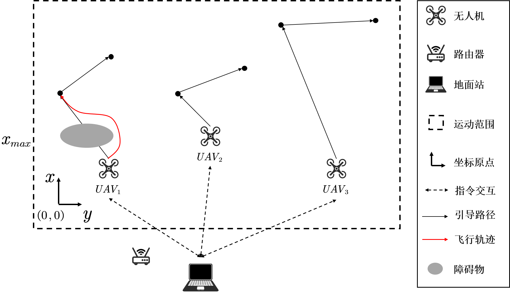

# 0 项目说明

- 在配置文件中写明了不同 AprilTag 在世界坐标系下的位置。实时订阅所有无人机的实时位置。分配目标点到所有无人机上，无人机利用 ego_planner 完成运动规划。
- gazebo rotors中要加载的资源非常多，因此整体非常非常卡顿，不确定提高电脑性能能否提高运行速度，需要具体测试。
# 1 下载配置说明
- 环境说明：`Ubuntu20.04`、`ROS1.0 Noetic`
- 下载编译
```shell
# 务必保持这个目录，后续一键运行脚本是基于这个目录的
mkdir -p ~/UWB_Path_Planning/src
cd ~/UWB_Path_Planning/src
git clone https://github.com/HK-Zhong/UWB_Path_Planning.git
cd ~/UWB_Path_Planning/

# 编译较为耗时，性能不够可能会自动关机
catkin_make
```
- chmod 一键运行脚本
```shell
chmod +x ~/UWB_Path_Planning/src/UWB_Path_Planning/utils/shfiles/*.sh
```
# 2 代码模块说明
## 2.1 rotors_simulator & mav_comm
- 该功能包提供了无人机和gazebo world的仿真，默认启动运行的launch文件在`rotors_simulator/rotors_gazebo/launch` 中，其中`multi_uav.launch`为启动多架无人机的脚本，需要增加新的无人机时可以按照如下方式添加新的无人机，注意需要设置好其中的`<arg name="x" value="40.0"/>`、`<arg name="y" value="10.0"/>`及`<arg name="z" value="1"/>`，还有`<node name="waypoint_publisher" pkg="rotors_gazebo" type="waypoint_publisher" output="screen" args="40 10 1 180 5"/>`，其中`40 10 1`是坐标位置，后面两个分别是偏航角和响应时间，一般不用改。需要减少无人机时注释掉某个`<group ...> </group>` 代码块即可。
    ```launch
    <group ns="ardrone_1">
      <include file="$(find rotors_gazebo)/launch/spawn_mav.launch">
        <arg name="number" value="1"/>
        <arg name="mav_name" value="ardrone" />
        <arg name="model" value="$(find rotors_description)/urdf/mav_with_vi_sensor.gazebo" />
        <arg name="enable_logging" value="$(arg enable_logging)" />
        <arg name="enable_ground_truth" value="$(arg enable_ground_truth)" />
        <arg name="log_file" value="ardrone1"/>
        <arg name="x" value="40.0"/>
        <arg name="y" value="-10.0"/>
        <arg name="z" value="1"/>
        <arg name="yaw" value="3.14159"/>
      </include>
      <node name="lee_position_controller_node" pkg="rotors_control" type="lee_position_controller_node" output="screen">
        <rosparam command="load" file="$(find rotors_gazebo)/resource/lee_controller_ardrone.yaml" />
        <rosparam command="load" file="$(find rotors_gazebo)/resource/ardrone.yaml" />
        <remap from="odometry" to="odometry_sensor1/odometry" />
      </node>
      <node name="robot_state_publisher" pkg="robot_state_publisher" type="robot_state_publisher" />
      <node name="joint_state_publisher" pkg="joint_state_publisher" type="joint_state_publisher" />
      <node name="waypoint_publisher" pkg="rotors_gazebo" type="waypoint_publisher" output="screen" args="40 -10 1 180 5"/>
    <node pkg="rotors_gazebo" type="DistanceCalculator.py" name="drone1_distance_calculator">
      <param name="drone_id" value="1"/>
      <param name="num_drones" value="$(arg num_drones)"/>
    </node>
    </group>
    ```
- 可根据实际情况选择合适的gazebo world，需要在world文件中添加`<plugin name="ros_interface_plugin" filename="librotors_gazebo_ros_interface_plugin.so"/>`以确保无人机能够正确加载起飞。

- 在`rotors_simulator/rotors_gazebo/launch/multi_uav.launch`文件中的`<arg name="gui" value="false"/>`修改是否开启 gui。
## 2.2 utils
## 2.3 ego_planner
- 对[ego_planner](https://github.com/ZJU-FAST-Lab/ego-planner)进行修改以支持rotors仿真的接入，以及达到航点后的巡查策略。
- 虽然在仿真过程中需要涉及到集群规划，但在这里并没有用ego_swarm，而是对ego_planner进行一定的修改。
- 启动`~/UWB_Path_Planning/src/UWB_Path_Planning/ego-planner/src/planner/plan_manage/launch/swarm.launch`可以实现多无人机规划的仿真
    - `swarm.launch`的仿真中接入了`single.launch`，在`single.launch`中启动了`ego_planner`、`apriltag_ros`、`apriltag_detect`以及`odom_visualization`
- `~/UWB_Path_Planning/src/UWB_Path_Planning/ego-planner/src/planner/plan_manage/launch/rviz.launch`是多无人机运动规划的可视化配置，已经配置好了最多五架无人机规划的可视化
- 如果要增加无人机，可以在`ego-planner/src/planner/plan_manage/launch/swarm.launch`文件中添加如下代码块，其中的`/ardrone_4`记得都要修改为对应的。
```shell
<include file="$(find ego_planner)/launch/single.launch">
    <arg name="prefix" value="ardrone_4"/>
    <arg name="odom_topic" value="/ardrone_4/odometry_sensor1/odometry"/>
    <arg name="depth_topic" value="/ardrone_4/vi_sensor/camera_depth/depth/disparity"/>
    <arg name="cmd_topic" value="/ardrone_4/command/pose"/>
    <arg name="max_vel" value="$(arg max_vel)"/>
    <arg name="max_acc" value="$(arg max_acc)"/>

    <arg name="map_size_x" value="$(arg map_size_x)"/>
    <arg name="map_size_y" value="$(arg map_size_y)"/>
    <arg name="map_size_z" value="$(arg map_size_z)"/>

    <arg name="camera_name" default="/ardrone_4/vi_sensor/left" />
    <arg name="image_topic" default="image_raw" />
</include>
```
# 3 使用说明
```shell
# 启动仿真环境
cd ~/UWB_Path_Planning/src/UWB_Path_Planning/utils/shfiles/

# 打开 rotors 仿真环境，默认是不开启 gui 的，如需开启，修改参数，详情阅读相应章节
# 很容易冲突出错，关掉后等一会再重启
./1_start_rotors.sh

# 同一目录下开启新的终端，启动规划节点
./2_start_planner.sh

# 同一目录下开启新终端，启动节点位置发送节点
./3_flag_publisher.sh

# 同一目录下开启新终端，启动话题记录节点，录制的 rosbag 就在当前的目录下，因为非常卡，所以无法当时录制视频，录制数据后回放
./4_record.sh

# 同一目录下开启新终端，启动 rviz 可视化节点，如果非常卡，这个可视化也可以不启动，过一段时间启动一下查看是否完成任务后立马关闭
./5_start_rviz.sh
```
# 4 录制数据重放说明
- 录制数据在 `~/UWB_Path_Planning/src/UWB_Path_Planning/utils/shfiles/` 目录下，先利用 `./5_start_rviz.sh` 打开 RVIZ 可视化终端，然后开启录屏软件，随后利用 `rosbag play xxxxx.bag` 指令播放数据。
